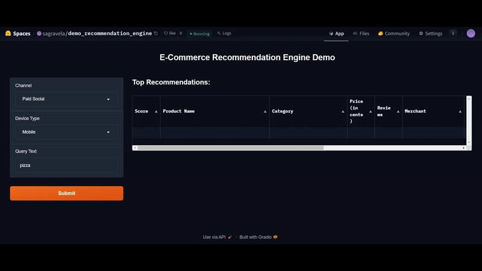

# E-commerce Recommendation Engine

This project demonstrates the end-to-end implementation of a deep learning-based recommendation system using [rec_engine](https://github.com/sagravela/rec_engine), a Python packege of my own, which leverages TensorFlow Recommenders (TFRS) under the hood. The system is designed to deliver personalized product recommendations by analyzing user interactions such as searches, clicks, add-to-cart actions, and purchases. It leverages a dataset of user interaction data sourced from an e-commerce platform and applies advanced deep learning techniques to model user preferences. This approach enhances the shopping experience by providing highly relevant product suggestions tailored to individual users, making the recommendation system both accurate and scalable.

## Model Features

- **Unified Model Architecture**: Integrates the entire recommendation system into a single cohesive model, including all necessary preprocessing layers.
- **Advanced Embeddings**: Utilizes embeddings for both users and candidates to capture and leverage latent features, enhancing recommendation precision.
- **Deep Neural Network**: Employs a multi-layered deep neural network on top of embeddings to model complex user-candidate interactions and improve recommendation quality.
- **Multi-Task Learning Capabilities**: Supports various tasks, including retrieval and ranking, within the same framework to streamline performance.
- **Efficient Retrieval**: Optimizes the retrieval process to quickly identify and suggest the most relevant products for user queries.
- **Enhanced Ranking**: Refines the ordering of recommended products based on user preferences and contextual relevance.
- **Flexible and Extensible**: Designed to be easily adaptable with additional features and interactions to suit diverse use cases.

## Additonal Features

- **Remote Database**: Integrates with a remote MySQL database to store and retrieve up-to-date user interaction data, enabling scalable storage.
- **API**: Exposes a REST API for easy integration with other systems and applications.
- **Training DAG with Airflow**: An ETL pipeline is implemented to extract, preprocess, and train the model on a weekly basis.
- **Optuna Optimization**: Utilizes Optuna for hyperparameter optimization, allowing the model to find the best configuration for the given dataset.

Try out the demo on [Hugging Face Space](https://huggingface.co/spaces/sagravela/ecommerce-recommendation-system).
